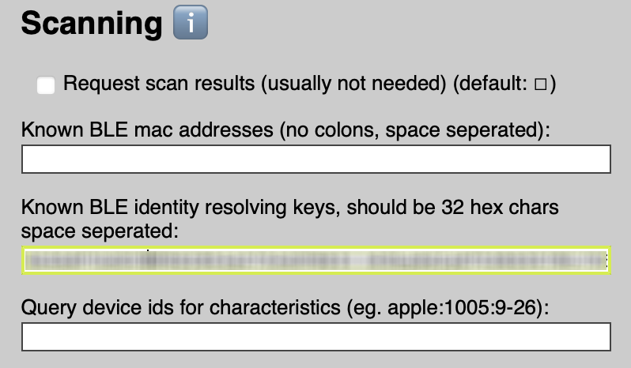
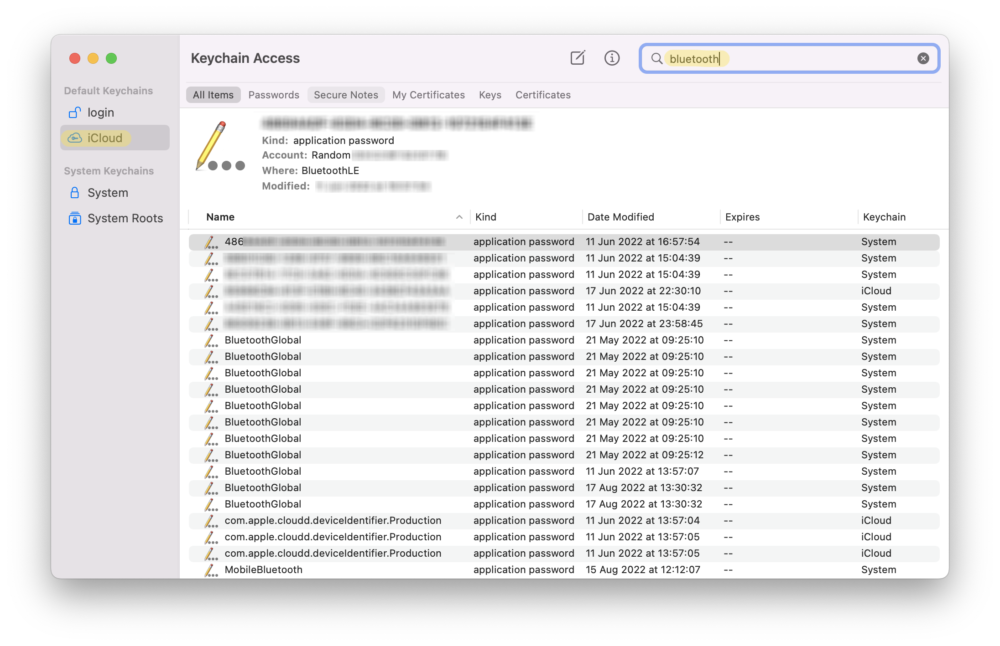
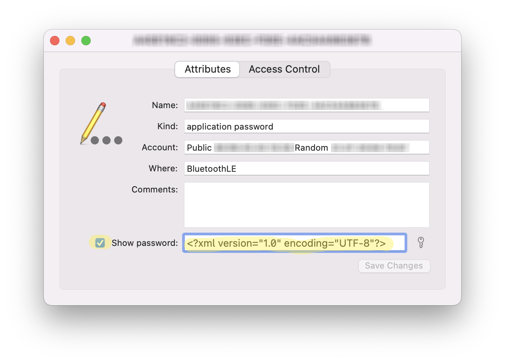

Apples devices emit various [btle continuity](https://github.com/furiousMAC/continuity) messages and the fingerprint `apple:100?:*-*` is often the one seen. Unfortunately if your household has many iPhones, eventually the nearby info will start to collide and lead to duplicate fingerprints.

To work around this you can get the remote IRK (identity resolving key) from your iOS (iPhone) or Watch OS (Apple Watch) device and add this to the `Known BLE identity resolving keys` section of the Espresense configuration.

> **Note: Espresense version 3.0.0b6 or higher is needed!**

## iOS (manual setup)

To automatically get the IRK for your iOS device you can pair it with an Espresense instance and the key will be visible in the `espresense/settings` topic. You can either manually add it to your configuration or let HASS configure it for you.

1. Go in your browser to the Espresense devices page: `http://espresense-office/devices`
2. **Fill in** a name for your device in the **name field** and **click** the **Enroll** button.
3. **On your iPhone** to to **Settings** -> **Bluetooth** and you'll see a new **Espresense** device.
4. **Pair** the device and the key becomes visible in the MQTT topic `espresense/settings`

> Tip: use MQTT explorer to view the RAW messages.

Now you can add the 32-bit key to the `Known BLE identity resolving keys` section of the Espresense configuration and to your HASS configuration with the following syntax: `irk:xxxxxxxxxxxxxxxxxxxxxxxxxxxxxxxx`



## Watch OS

An Apple Watch cannot be paired with Bluetooth to the ESPresense instance. You have to extract the IRK from iCloud with the Apple Keychain application on MacOS.

1. **On MacOS**, make sure you are **logged in** with the **iCloud ID** with which the Apple Watch is configured.
2. **Start** the **Keychain access** application.
3. In the left **sidebar** click on **iCloud**
4. In the upper right **search bar** type `bluetooth`
5. A series of GUIDs are shown with the *application password* type.
   
    

1. **Open** the correct **GUID** and **click** on **Show password**
2. **Type** your MacOS password **twice** and **copy** the **XML contents** to a text editor.

    

3. **Find** the `Remote IRK` key and **copy** the *base64 encoded* string in the *data* key:

    ```xml
    <key>Remote IRK</key>
    <data>aGktZnJvbS1qb2Vw</data>
    ```

> Tip: to easily find your Apple Watch GUID go **on your Apple Watch** to the **Settings** app -> **General** -> **Info** and look under **Bluetooth** for the MAC address. If you open a GUID in the Apple Keychain you see this address under **Account** -> `Public: XX:XX:XX:XX:XX:XX`

9. [Decode](https://base64.guru/converter/decode/hex) the *base64 encoded* key to **HEX**.
10. The last step is to **reverse** the HEX key, for example: `4A4F4550` will be `50454F4A` (note that you reverse the *bytes*!)
    
Now you can add the 32-bit key to the `Known BLE identity resolving keys` section of the Espresense configuration and to your HASS configuration with the following syntax: `irk:xxxxxxxxxxxxxxxxxxxxxxxxxxxxxxxx`

